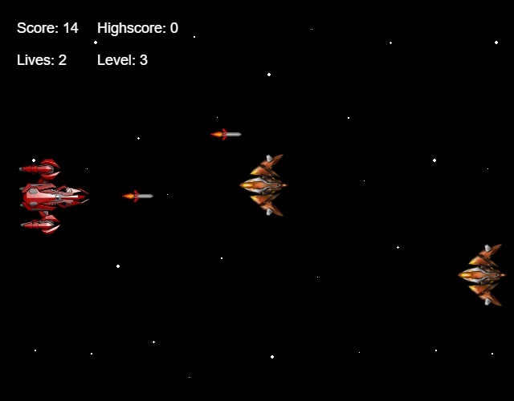

# Space Invaders
A different version of the classic Space Invaders game.

## Demo

The live version of the game can be viewed here: [Demo Link](https://aadityabhusal.github.io/javascript-games/space-invaders/).

## Screenshots

## Problems

The following are the problems in the current version of the game. They will be solved soon.

1. The code in not modular and a little spaghetti.
2. The player and enemy's moving rate when speed increases linearly. There is no limit.
3. The collision and explosion position of the player and enemy is not accurate. 
4. Enemies and missiles refresh when an element in the corresponding array are spliced (removed). This creates a visible flick in the rest of the enemies and missiles and also create timing problem and sometimes a miss in player and enemy collision.
5. Player goes outside the frame when up and down keys are pressed continuously due to large pixel change in player's movement.
6. Pauses, intros, restart buttons and actions.